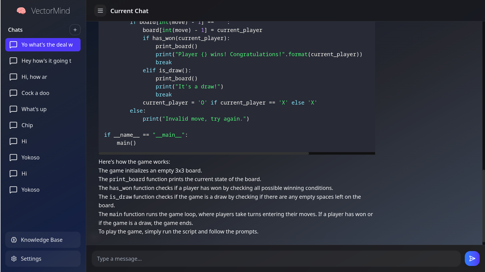

# VectorMind 🧠💡

VectorMind is an intuitive app that allows you to upload your own knowledge base and chat with it! Whether you're working on a project, learning something new, or organizing a repository of ideas, VectorMind brings your knowledge to life with an easy-to-use interface and smart interaction.



## Features

Upload your knowledge: Add your documents, notes, or even entire databases to create a personalized knowledge base.

Interactive chat: Ask questions and get insights from your uploaded knowledge base directly via a chat interface.

Customizable responses: The app adapts and delivers responses based on your specific information, making it feel like a personalized assistant.

Seamless experience: User-friendly design and smooth chat functionality to make your knowledge accessible anytime, anywhere.

## How It Works

**Upload**: Upload your knowledge base (texts, files, or documents).

**Interact**: Use the chat interface to ask questions or dive deep into specific topics.

**Get Insights**: VectorMind will intelligently respond based on the data you've provided.

##Technologies Used

**Python**: For backend and logic execution.

**Machine Learning**: Powering the chat interactions for smarter responses.

**Frontend**: Sleek, minimalistic UI for an enjoyable user experience.

## Getting Started

**Clone the repository:**

git clone https://github.com/sriniwas14/VectorMind.git

**Docker Compose**

```bash
docker compose up
```

This starts a server on http://localhost:4269

Upload your knowledge base and start chatting!

Contributing

We welcome contributions! If you'd like to contribute to the development of VectorMind, feel free to fork the repository, make your changes, and submit a pull request. Your ideas and improvements are always appreciated.

License

Distributed under the MIT License. See LICENSE for more information.
